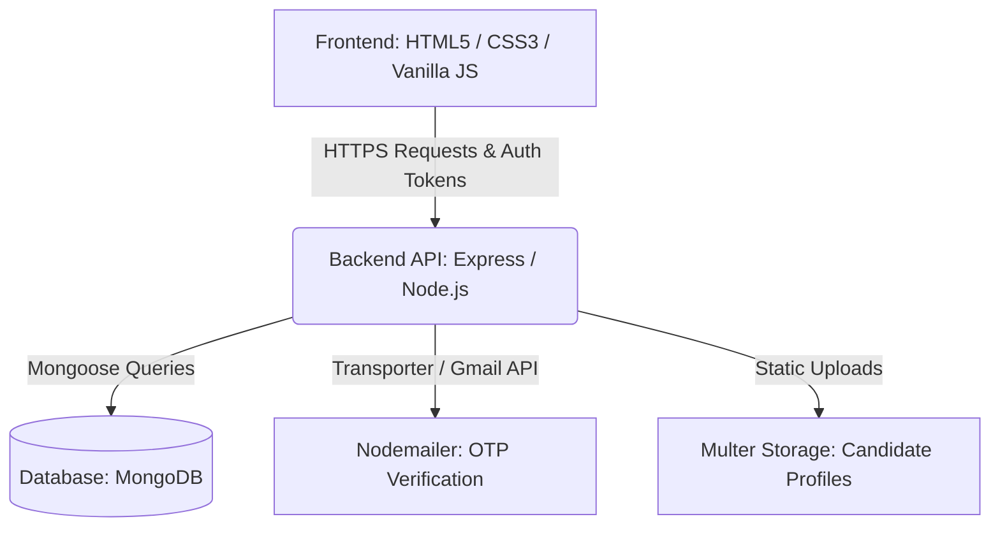

# 🗳️ SmartCampus Election - Full-Stack Application

[](https://nodejs.org/)
[](https://expressjs.com/)
[](https://www.mongodb.com/)
[](https://developer.mozilla.org/en-US/docs/Web/JavaScript)
[](https://developer.mozilla.org/en-US/docs/Web/CSS)

SmartCampus Election is a secure, responsive, and robust **Full-Stack Campus Election Management System** designed for modern universities. It features role-based access control, a secure voting ballot flow, real-time OTP verification via email, and comprehensive administrator dashboard controls.

The application leverages a database-driven architecture using **Node.js, Express, and MongoDB (Mongoose)** for the backend, and a premium **HTML5, CSS3, and Vanilla JavaScript** implementation for the client-side user experience.

---

## 🏛️ System Architecture



---

## 🌟 Key Features

### 📢 Public & Visitor Features
*   **Dynamic Landing Page**: Responsive homepage with current election info, phases, and schedule.
*   **Candidate Directory**: Comprehensive search, position-based filtering, sorting, and rich biography profiles.
*   **Official Notifications**: Live bulletin board for announcements and policy notices.
*   **Contact Form**: Contact submission with instant database logging for admins.
*   **Email-Verification Auth**: Complete registration and password-reset flow secured by automated OTP emails.

### 🗳️ Student / Voter Dashboard
*   **Active Ballot Submission**: Secure vote submission with real-time eligibility checks.
*   **Interactive Ballot Review**: Clear summary of selected candidates before finalizing.
*   **Vote-Lock Protection**: Once a vote is finalized, the ballot is locked to prevent double-voting.
*   **Live Results Feed**: Immediate graphical results once officially published by the admin.

### 🎗️ Candidate Management Portal
*   **Nomination Application**: Form submission with position selection, slogan, achievements, and manifesto.
*   **Campaign Management**: Upload and configure campaign images, biography, and platform files.
*   **Campaign Sandbox**: Live, previewable candidate-profile pages visible to other students.

### 🛡️ Admin Dashboard & Governance
*   **System Configuration**: Configure election title, timelines, and phase transitions (Nomination, Voting, Completed).
*   **Candidates Review & Approval**: Review pending candidate applications, verify academic details, and approve/reject profiles.
*   **Voters Registration Control**: View user records, adjust registration status, and oversee user permissions.
*   **Notices Management**: Author, publish, edit, or archive official election announcements.
*   **Results Publication**: Toggle real-time results updates and officially publish final election results.
*   **Comprehensive Audit Logs**: Dynamic dashboard capturing every key administrative action for transparency.

---

## 📂 Project Directory Structure

```text
SmartCampus-Election/
│
├── backend/                  # Node.js + Express API Backend
│   ├── config/               # Database and server config
│   ├── controllers/          # Business logic handlers (auth, students, admins)
│   ├── data/                 # Sample data files
│   ├── middleware/           # Authentication and route protection
│   ├── models/               # Mongoose DB schemas (Users, Candidates, Votes)
│   ├── routes/               # API endpoints setup
│   ├── seed/                 # Database seed script and candidates database
│   ├── uploads/              # Candidate profile pictures & document storage
│   ├── server.js             # Entrypoint for backend server
│   └── package.json          # Node dependencies and scripts
│
├── frontend/                 # Client-side SPA/Pages
│   ├── assets/
│   │   ├── css/              # Core stylesheets (forms, tables, responsive)
│   │   ├── js/               # Frontend API handlers and page logic
│   │   └── images/           # Layout assets, banners, icons
│   ├── *.html                # Role-specific interfaces (Student, Candidate, Admin)
│   └── README.md             # Frontend-specific documentation
│
├── SETUP_GUIDE.md            # Quick Start installation guide
└── README.md                 # Project main README (this file)
```

---

## 🛠️ Quick Installation & Setup

Please refer to the detailed [SETUP_GUIDE.md](file:///e:/WEB%20PROJECTS/SmartCampus-Election-FullStack-Final/SmartCampus-Election-FullStack/SETUP_GUIDE.md) to get the backend and frontend up and running locally.

### Fast Track Checklist:
1. Ensure a local instance of **MongoDB** is running.
2. In `/backend`: run `npm install`, duplicate `.env.example` as `.env`, seed with `npm run seed`, and start with `npm run dev`.
3. In `/frontend`: run the workspace using VS Code's **Live Server** (defaults to port `5501`).
4. Log in using `admin@smartcampus.edu` / `Admin@12345` to manage the election!

---

## 🔒 Security Measures
*   **JWT Authentication**: Stateless, signed token authorization for API endpoints.
*   **Bcrypt Password Hashing**: Zero plain-text passwords stored in the database.
*   **Role Validation Middleware**: Strict server-side checks to isolate voter, candidate, and administrator APIs.
*   **Double-Vote Protection**: Cryptographic and schema-level validation preventing duplicate ballots.
